

# Kubo

### See your server. Run nothing on it.

**Kubo** is a desktop app that connects to **your own Linux server** over SSH and turns it into
something you can *look at* — live performance, what is really exposed, your files, your services,
Docker, Redis, packages — drawn in particles instead of packed into tables.

**Nothing is installed on the server. Nothing ever leaves your machine.**

[**⬇ Download for Windows**](https://github.com/Lightminedust/Kubo/releases/latest) &nbsp;·&nbsp;
[**⬇ For Linux**](https://github.com/Lightminedust/Kubo/releases/latest) &nbsp;·&nbsp;
brings its own Java &nbsp;·&nbsp; ~75 MB

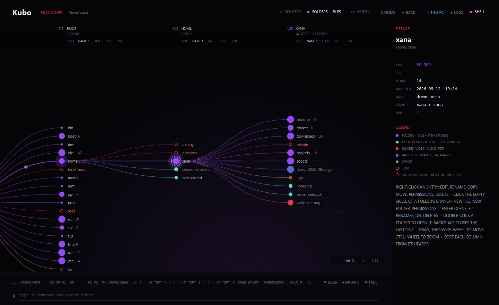

---

## Why Kubo

You already have a terminal. Kubo doesn't replace it — it sits beside it, so you can manage a
container on a map *and* in a shell at the same time, and the log shows you both. It's built for
the person who runs one server and wants to actually understand it, not decode it.

- **Nothing installed** — Kubo only runs ordinary shell commands over SSH. No agent, no daemon,
  nothing left behind on the server.
- **Nothing leaves your machine** — it talks to your server and to no one else. No telemetry, no
  account, no cloud. Your data stays yours.
- **Every command shown** — everything Kubo sends is listed as it happens and written to a local
  log — the commands, never their output.

---

## What it does

Each screen is the same server told a different way. All of it read-only until you ask for a
change, and every change simulated or confirmed first.

### Files — browse and manage, as a living tree
The folders open left to right, one column per level, every entry a point of light on a fibre.
Right-click to edit, rename, copy, move, set permissions, download or delete; drag files from your
PC onto a folder to upload. Quicker to read — and to trust — than the tools most people put up with.

### Network — see what is really exposed
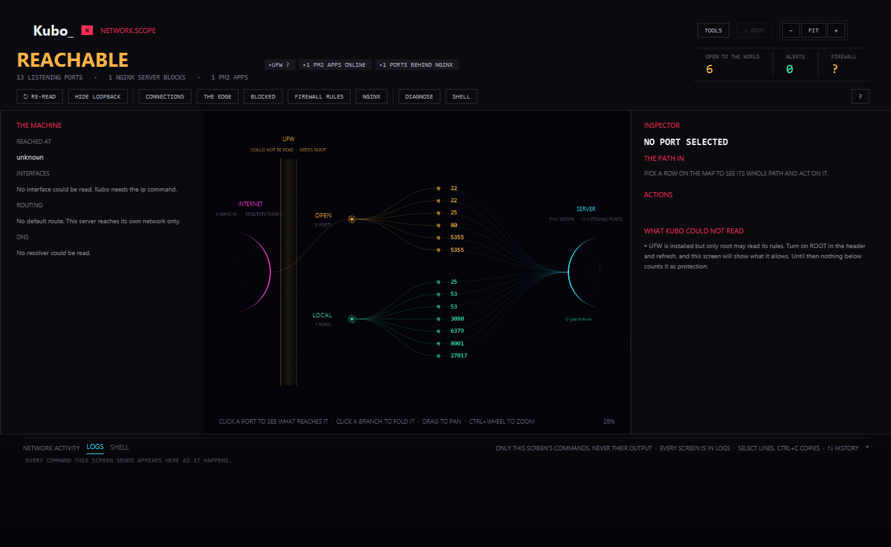

The internet on one side, your server on the other, the firewall as a pane of glass between them.
Ports branch off by how far they can truly be reached — exposed, open, shielded, private, local —
so an open database screams and a loopback-only port stays quiet. Reads whichever firewall you run:
**UFW, firewalld, nftables or iptables**.

**UFW is written as well as read.** The rules are grouped the way a person would say them, v4 and v6
together. Open a port to one address rather than to everyone, close one, switch the whole firewall on
or off. Removing a rule that would cut your own SSH session asks you to type the port first, and
switching a firewall on that has nothing allowing SSH asks the same question UFW asks itself — the one
a session with no terminal cannot answer.

### Nginx — how a request actually gets there
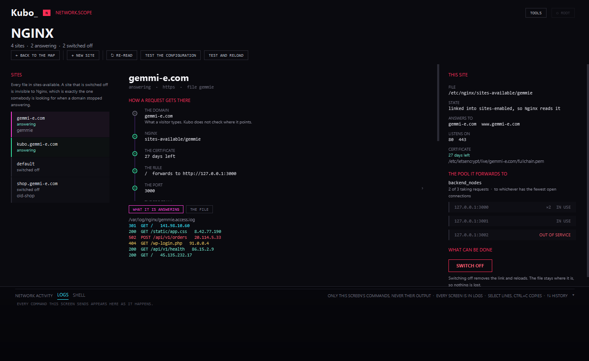

Its own screen, not a panel. The sites on the left; for the one you pick, the path a request takes drawn
as a chain that goes red at the step that breaks: the domain, the server block, the certificate, the
rule, the port it ends on. Its access and error logs, the file it lives in, the upstream pool it
forwards to and which members are answering.

A new site is written from a form with presets for Node, a single-page app, static files or PHP. Every
field is checked before anything is sent, the file is shown exactly as it will be written, and it goes
out through a temporary file and a move.

Serving the web with **Caddy, Apache, Traefik or HAProxy** instead? Kubo names what it finds, says where
its configuration lives and gives you the command to check it, rather than reporting that there is no
Nginx — which reads as no web server at all.

### Blocked — everything the server has shut out
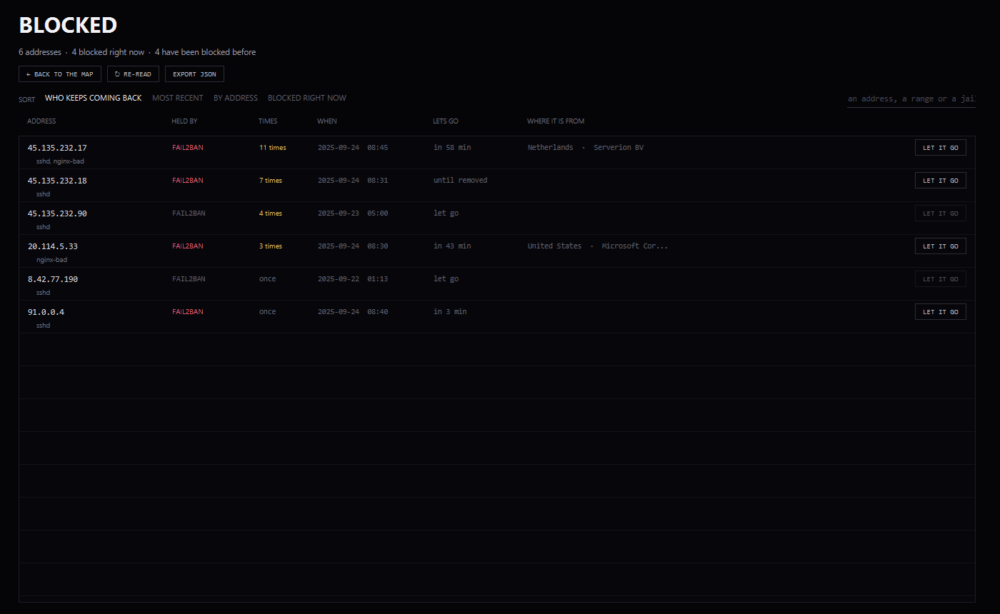

Two hundred addresses each banned once is a machine doing its job. Five banned eleven times each is
somebody who has decided to get in, and the two look identical from a number.

One row per address, sorted by which of them keep coming back, with when, how often, how long is left
and who owns it. fail2ban's client names what is banned right now; its database knows the dates and the
counts. Firewall rules are in the same list, marked as what they are: a ban lets go by itself, a rule
stays until somebody removes it. The whole journal downloads as JSON — addresses and counts only, never
a log line.

### Services — is it running, and will it come back
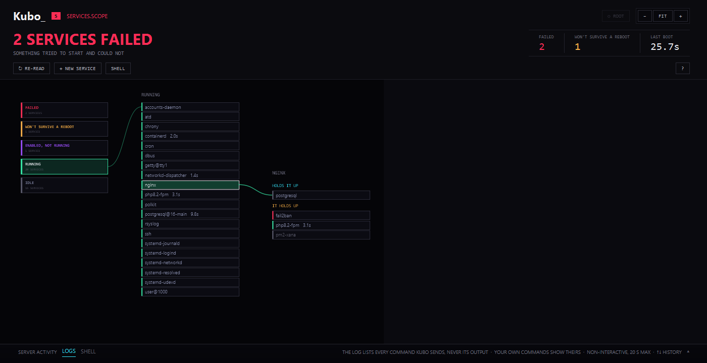

A terminal answers those as two separate questions, and nobody asks both about forty services. So a
server can run for months with something important that will simply not be there after the next
reboot. Kubo asks both for every unit and sorts them by what the two answers add up to: **failed**,
**won't survive a reboot**, **enabled but not running**, **running**, **idle** — each its own
colour. Click one and the tree keeps growing to the right: what holds it up, then what it holds up.

Start, stop, restart, enable, disable. Cap a runaway service's memory or its share of the processor
without restarting it. Send it a signal. Give it settings of its own in a drop-in, so the file your
package shipped is never touched. Write a whole new service with the file tree right there to pick
what it runs. And delete one — but only a unit somebody put in `/etc/systemd/system` by hand, never
a file that belongs to a package.

Stopping or disabling **sshd**, or the network under it, is refused outright rather than confirmed.
That is the one mistake with no way back: the server keeps running, perfectly healthy, and you can
never reach it again.

### The rest

| | |
|---|---|
| 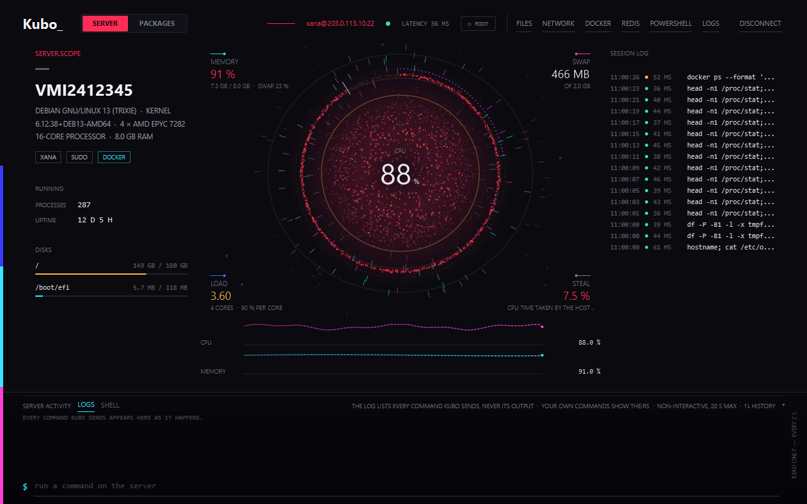 | **Scope** — the machine itself: OS, kernel, CPU, RAM, drawn as a spinning particle sphere with memory, swap, load and steal around it. |
| 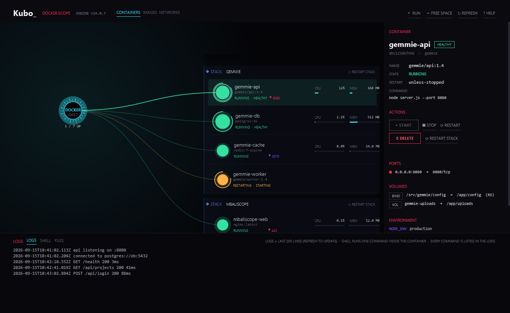 | **Docker** — containers, state, CPU/memory, ports and volumes; start/stop/restart, logs, a shell inside, and a read-only browse of the container's files. |
| 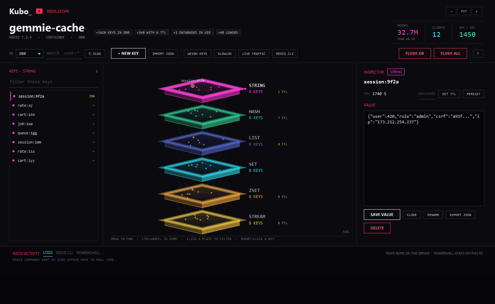 | **Redis** — a stack of lit slabs, one per type, with full key CRUD, JSON edit, memory profiling, SLOWLOG and a live CLI. Never runs `KEYS *`. |
| 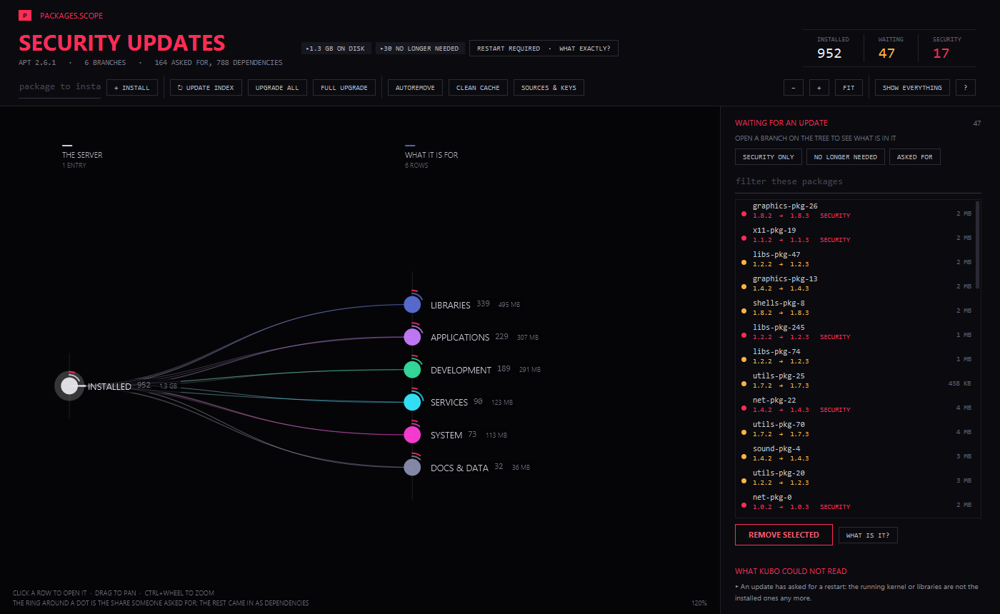 | **Packages** — everything apt/dpkg report as a branching tree: what's for the system, what you asked for, what's waiting. Upgrades are watched as they happen, simulated first, and what a removal would take with it is said before you confirm. The repositories a machine fetches from, and the signing keys behind them, are on their own screen. |
| 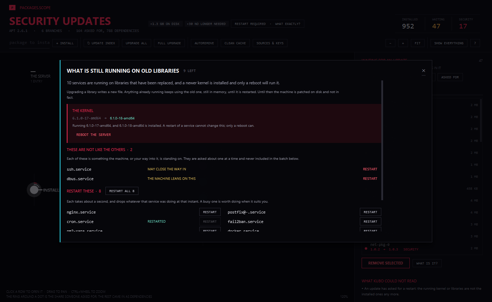 | **What is still running on old libraries** — upgrading a library writes a new file; anything already running keeps using the old one until it is restarted. So a server can be fully patched on disk and still be serving through the flaw the patch closed. Kubo lists which services those are, with a button each, and keeps apart the two or three the machine is standing on. |

And a connection screen that reads the handshake as a fall of ones and zeros:

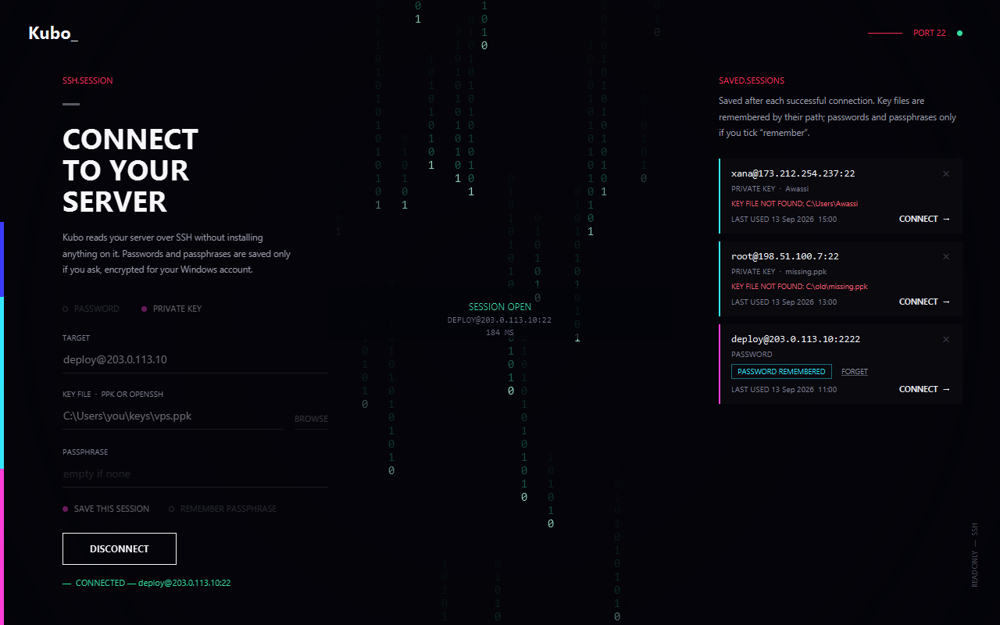

---

## Security

Kubo asks for a lot — SSH access, sometimes root. So it's built so you never have to take that on
faith.

- **Host keys, checked** — first contact shows the fingerprint and asks; a server whose key changed
  is refused outright.
- **Secrets held, then wiped** — passwords live in memory as raw bytes and are wiped after use.
  Saved only if you tick *remember*, encrypted with Windows DPAPI for your account.
- **Root only when you say so** — Kubo never elevates on its own. One button asks for sudo, once per
  session, and every window reads `Kubo_root` while it's on.
- **Nothing destructive by surprise** — changes are simulated or confirmed by typing the name back;
  commands that need root are fixed templates, never built from what you type.
- **Everything on the record** — every command is listed and logged locally: the command and its
  size, never the output or your files.

---

## Install

**Windows** — download **[Kubo Setup](https://github.com/Lightminedust/Kubo/releases/latest)** and
run it. Windows may show an *"unknown publisher"* notice (the installer isn't code-signed yet) —
choose **More info → Run anyway**. Then launch Kubo from the Start menu.

**Linux** — a `.deb` for Debian and Ubuntu, an `.rpm` for Fedora, RHEL, Rocky, Alma and openSUSE,
both on the [releases page](https://github.com/Lightminedust/Kubo/releases/latest). One note: Windows
has DPAPI to encrypt a secret for one account, and Linux has no equivalent every machine is
guaranteed to have — so Kubo simply does not store passwords there, rather than writing one
somewhere it could be read. Key files are still remembered by their path.

**Neither** — the portable editions, a `.zip` and a `.tar.gz`, unfold anywhere and need no installer
and no administrator. Nothing is written to the registry or to `/usr`, and nothing is left behind.

Then enter your server (`user@host`) and connect.

**Your server** just needs to be a normal Linux box with GNU coreutils and `ss` — Debian, Ubuntu,
RHEL, Rocky, Alma, Fedora, Arch, openSUSE… all work. *Packages* needs apt/dpkg (Debian family);
every other screen works anywhere.

---

## About

Kubo is a **[Gemmie](mailto:nellawassi@gmail.com)** product, free to use. It is proprietary
software — the source is not published here, and what ships is obfuscated — but it collects nothing
and phones no one: everything it does happens between your computer and your server. See
[LICENSE](LICENSE.txt) for the terms.

*Found it useful? A ⭐ helps other people find it.*
